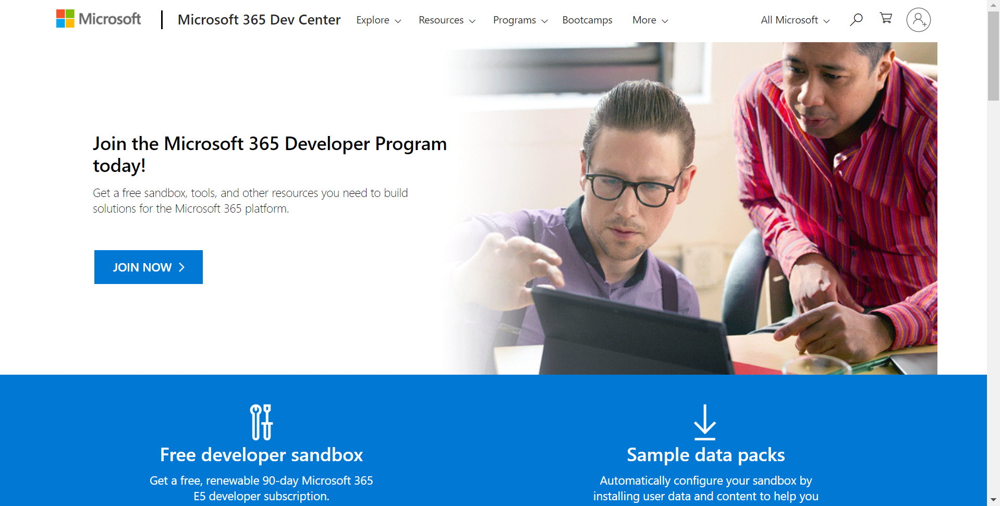
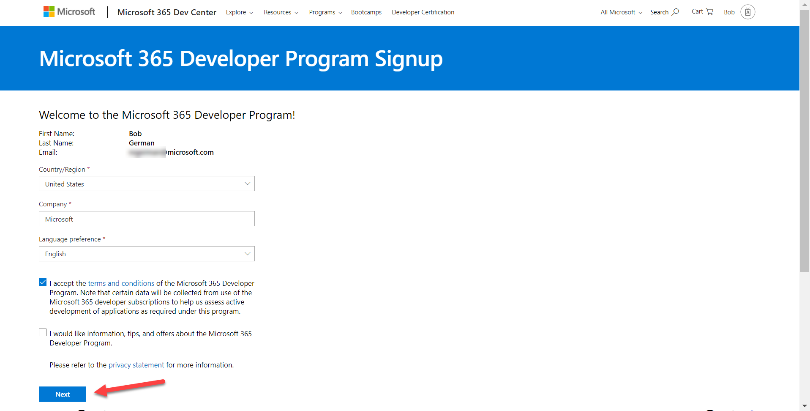
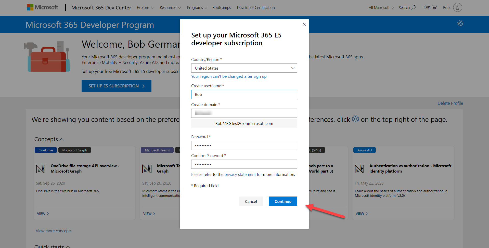
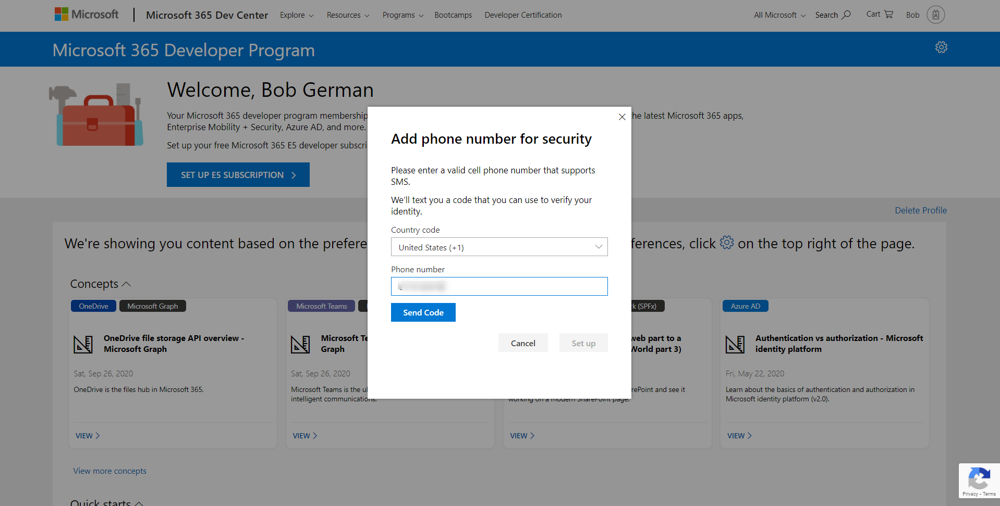
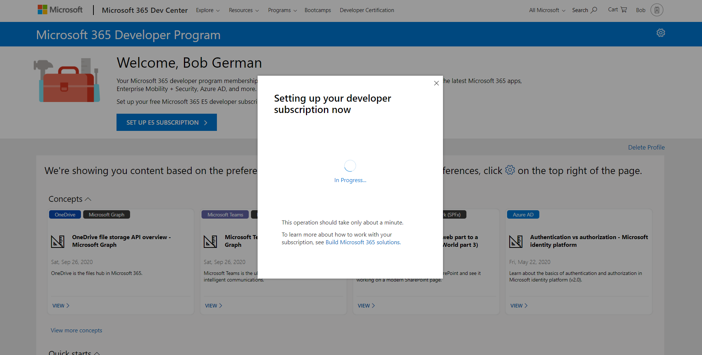
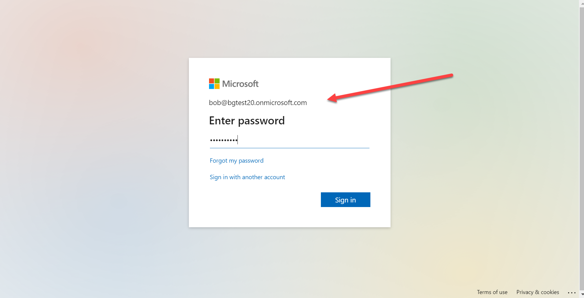
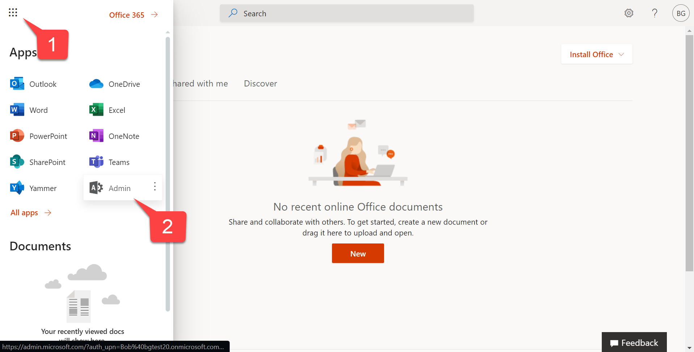

# Exercise 1: Lab Setup

 * [Exercise 1: Lab setup](Exercise1.md) **(You are here)**
 * [Exercise 2: Build a JavaScript single-page app with Microsoft Graph](Exercise2.md)
 * [Exercise 3: Warehouse Packing App with Microsoft Graph Toolkit](Exercise3.md) 
 * [Resources](Resources.md)

In this section, you'll set up your tenant for Graph development.

## Step 1: Get a tenant

If you don't yet have a tenant, please join the [Microsoft 365 Developer Program](https://developer.microsoft.com/microsoft-365/dev-program?WT.mc_id=M365-github-rogerman) to get a free one. Your tenant includes 25 [E5 user licenses](https://www.microsoft.com/microsoft-365/enterprise/compare-office-365-plans?WT.mc_id=M365-github-rogerman) and can be renewed as long as you keep developing!

Click "Join now" to begin.

Log in with any Microsoft personal or work and school account, enter your information, and click "Next".

You will be presented with a number of check boxes about your development interests; check what you like and then click "Next" again. On the final screen, enter a username, domain name, and password. The domain name you choose is just the left-most portion - for example if you enter "Contoso" your domain will be "Contoso.onmicrosoft.com".

Remember this information as you'll need it throughout the labs! You will log in as <username>@<domain>.onmicrosoft.com with the password your chose. You'll be prompted for your phone number  and then the system will set up your subscription.

Soon after you'll be prompted to log in. Be sure to use the new credentials you just created, not the ones you used when you signed up for the developer program!

Go to the [Microsoft 365 admin center](https://portal.office.com/AdminPortal/Home#/homepage) and log in as an administrator of your new tenant. To navigate there, click the application launcher 1️⃣ and select Admin 2️⃣.

---
😎 DON'T DEVELOP IN PRODUCTION: It may be tempting to build solutions right where you work every day, but there are good reasons to have a dedicated dev tenant - and probably additional staging/test tenants. They're free, and you can safely experiment as a tenant admin without risking your production work. 

---
😎 NAVIGATING MANY TENANTS: Consider creating a browser profile for each tenant that will have its own favorites, stored credentials, and cookies so you can easily work in your development tenant(s) as well as your production environment.

When you're ready, please [proceed to the next section.](Exercise2.md)