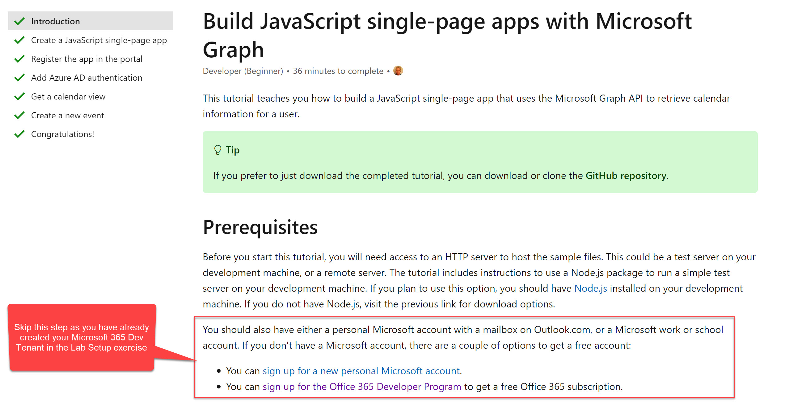

# Exercise 2: Build a JavaScript single-page app with Microsoft Graph

 * [Exercise 1: Lab setup](Exercise1.md)
 * [Exercise 2: Build a JavaScript single-page app with Microsoft Graph](Exercise2.md) **(You are here)**
 * [Exercise 3: Warehouse Packing App with Microsoft Graph Toolkit](Exercise3.md) 
 * [Resources](Resources.md)

In this section, you'll create a JavaScript Single Page Application (SPA) and use the Microsoft Graph API to read and render your calendar entries from your Microsoft 365 tenant to the webpage.

Follow the tutorial below to complete this exercise.

[Tutorial: Build JavaScript single-page apps with Microsoft Graph](https://docs.microsoft.com/en-gb/graph/tutorials/javascript)

Note that you can skip the prerequisite step of creating a developer tenant as you've already completed that in the lab setup.

When you're ready, please [proceed to the next section.](Exercise3.md)