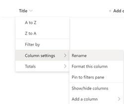

# Exercise 3: Warehouse Packing App with Microsoft Graph Toolkit

 * [Exercise 1: Lab setup](Exercise1.md)
 * [Exercise 2: Build a JavaScript single-page app with Microsoft Graph](Exercise2.md)
 * [Exercise 3: Warehouse Packing App with Microsoft Graph Toolkit](Exercise3.md) **(You are here)**
 * [Resources](Resources.md)
 
The scenario for this exercise is that our company sells products online and those online orders are created in a SharePoint List. We are going to build a lightweight single page web application using HTML, CSS and JavaScript for the warehouse packing staff to be able to view the orders that are ready for packing on a small device. The warehouse staff will carry this device with them as move about the warehouse collecting and packing the products into a box for the customer. When they are done our web application will also allow the packing staff to mark the order as packed.

## Clean up after completing Exercise 2
If you still have a command-line running your local http-server from Excerise 2 you will need to stop if before continuing as starting another http-server will create it on a different port number. To stop the http-server close your command-line window or use CTRL+C.

## Create the Warehouse Order list in SharePoint
Before we can start building our web application we need to setup the scenario by creating an `Orders` list in SharePoint. 

1. Create a new SharePoint site (select Team site as the type and give it the name `Warehouse`)


2. Add a new List to the SharePoint site


* Choose `Blank` rather than a template 
* Name = `Orders`
* Check the box to `Show in Site Navigation` (so we can find our list easily)


3. Add the following columns to the `Orders` list

When adding columns, ensure you use the modern UI as shown below. This will allow you to have spaces in your column names and generate an internal column name we use in code that doesn't have the space in it .


* Be very careful of column names as the code snippets reference these columns

| Column Name    | Column Type             | Notes                                                     |
|----------------|-------------------------|-----------------------------------------------------------|
| Title          | Single line of text     |                                                           |
| Status         | Choice (Drop-Down Menu) | Allow choices of: Requested, Ready for Packing, Delivered (enter each on a separate line) |
| Address        | Single line of text     |                                                           |
| Total Items    | Number                  |                                                           |
| Order Manifest | Multiple lines of text  |                                                           |
| Contact Name   | Single line of text     |                                                           |


4. Rename the `Title` column to `Order Number` by selecting the column header | Column Settings | Rename




5. Populate the orders list with 3 orders
* Give 2 orders the `Status` of `Ready for Packing`
* Give 1 order the `Status` of `Requested`

Your populated list should look similar to the following.


6. Create a new list index for the `Status` column
 * We need to do this because we want to query from our web application to find orders in a `Status` of `Ready for Packing`
 * Create the index under List Settings | Columns | Indexed Columns


🎉Celebrate a little, SharePoint is setup and ready to go. Let's go develop our web application! 😎

## Create the project directory
Create a new directory for the Warehouse Packaging App

## Start a local web server
In this section you will use http-server to run a simple HTTP server from the command line.

1. Open your command-line interface (CLI) in the directory you created for the project.

2. Run the following command to start a web server in that directory.
```
npx http-server -c-1
```

3. Open your browser and browse to `http://localhost:8080`.


## Create index.html
Create a new file in the project directory called `index.html` with the following content.
```
<html>
  <head>
    <link rel="stylesheet" type="text/css" href="styles.css">
  </head>
  <body>
    <header>
      <ul>
        <li>Warehouse App</li>
      </ul>
    </header>
  </body>
</html>
```

## Create a stylesheet for the application
Create a new file in the project directory called `styles.css` with the following content.
```
body {
    font-family: 'Segoe UI';
    font-size: 12px;
    background-color: #F3F2F1;
    margin: 0px;
}

ul {
    list-style-type: none;
    margin: 0;
    padding: 0;
    overflow: hidden;
    background-color: #333;
  }
  
li {
    font-size: 18px;
    float: left;
    display: block;
    color: white;
    text-align: center;
    padding: 14px 16px;
    text-decoration: none;
}

.order {
    display: flex;
    flex-direction: column;
    color: #444;
    border: 1px #EDEBE9 solid;
    width: 270px;
    height: 200px;
    background-color: #ffffff;
    margin: 10px;
    float:left;
    box-shadow: 2px 2px #E4E3E2;
    border-radius: 10px;
}

.orderheader {
    font-weight: bold;
    font-size: larger;
    background-color: rgb(200, 203, 233);
    padding: 5px;
    height: 25px;
    border-radius: 10px 10px 0 0;
}

button {
    text-align: center;
    padding: 10 5 10 5;
    font-family: 'Segoe UI';
    font-size: 14px;
    background-color: rgb(178, 207, 178);
    border-radius: 0 0 10px 10px;
}

button.inactive {
    visibility: hidden;
}

.orderbody {
    flex-grow: 2;
    white-space: pre-line;
    margin: 10px;
}

.orderfooter {
    font-weight: bold;
    font-size: larger;
    padding: 10px;
    height: 60px;
}
```

Save your changes to these 2 files and refresh the browser.


## Create App registration in Azure Active Directory
Before we can use the Graph Toolkit in our web application we need to create an app registration in Azure Active Directory. This is so that when we make calls to the Graph, Azure knows it is our app making the call and also allows the display of a consent prompt to the user to ensure they are ok with our app accessing information in their tenant.

1. Login to the [Azure Portal](https://portal.azure.com) using the account you created with your developer subscription.
2. Select Azure Active Directory in the navigation, then select App Registrations under Manage and click New registration.
3. On the Register an application page, set the following values:
* Set Name to `Warehouse App`
* Set Supported account types to Accounts in any organizational directory
* Under Redirect URI, set the drop-down to `Single Page Application (SPA)` and set the value to `http://localhost:8080/`


4. Click Register. Locate your application (client) ID. You will need to reference this later.


5. Under Manage on the left-hand navigation, select Authentication. Locate the Implicit Grant section and enable both Access tokens and ID tokens, then click Save.


## Add Microsoft Graph Toolkit (MGT) to the web application
Time to make the magic happen 🎩🐇

1. Add the Microsoft Graph Toolkit to our web application by including the Microsoft Graph Toolkit loader script in the `<head>` of our index.html file

```
<script src="https://unpkg.com/@microsoft/mgt/dist/bundle/mgt-loader.js"></script>
```

2. Add the mgt-msal-provider component to the top of the `<body>` in the index.html file. Insert the application (client) ID from your application registration in Azure Active Directory. You must set up a provider component so that the Graph Toolkit is able to identify your application to Azure. This provider is used by the other components in the Graph Toolkit.

```
<mgt-msal-provider client-id="{YOUR APPLICATION (CLIENT) ID}"></mgt-msal-provider>
```

3. Add the mgt-login component as a new `<li>` within the `<header>` of the index.html file. This will render the Grpah Toolkit Login control in the hader bar across the top of our application.

```
<li style="float:right"><mgt-login></mgt-login></li>
```

After completing the 3 steps above the index.html file should look like this (with the client-id substituted)

```
<html>
  <head>
    <script src="https://unpkg.com/@microsoft/mgt/dist/bundle/mgt-loader.js"></script>
    <link rel="stylesheet" type="text/css" href="styles.css">
  </head>
  <body>
    <mgt-msal-provider client-id="7ec83c73-e374-4a33-8b5c-280883c785d2"></mgt-msal-provider>
    <header>
      <ul>
        <li>Warehouse App</li>
        <li style="float:right"><mgt-login></mgt-login></li>
      </ul>
    </header>
  </body>
</html>
```


Save those changes and refresh the browser. You may not immediately see the login component, that's because its font color is the same as our header bar. Try hovering your mouse over the right end of the header bar and you should be able to see it 👀 This wasn't by chance, I wanted to show you how we can provide our own styling to the Toolkit components (which we will do in the next step).


## Add mgt-login component and customise the styling


Toolkit components allow for styling customisation. [This article explains how styling customisation works](https://developer.microsoft.com/en-us/graph/blogs/a-lap-around-microsoft-graph-toolkit-day-4-customizing-components/)

Add the following style rule to the bottom of the `styles.css` file
```
mgt-login {
    --color: white;
    --padding: 0 20px;
}
```

Save your changes and refresh the web browser. You should now see the mgt-login component, go ahead and sign-in using your Developer Tenant account. You will be prompted to give consent for the Warehouse application to access your data, once you do the login flow is complete and you can click on the mgt-login compnent to see your details.


Get outta town, we just added authentication and consent, a sign-in/out UI mechanism, returned the users profile image and account details by adding 3 lines of HTML (and no JavaScript!)

## Use Graph Explorer to verify query for SharePoint items
Back to the job at hand, we want to query the Orders list in SharePoint for any orders that are ready for packing, return the order details and show them on a card in our web application. Now which Graph Toolkit component should we use for that? Well as it happens there isn't a component specially for showing SharePoint items, but we can use the mgt-get component to make any Graph API call. The mgt-get component also allows us to provide a custom HTML template that will bind the returned properties and render to our web page.

We need to come up with the Graph API query that we will supply to the mgt-get component. To do this we are going to use the Grpah Explorer website.

1. Open the [Graph Explorer](https://aka.ms/ge) website
2. Sign-in to Graph Explorer using the credentials of your Developer Tenant
3. Enter the following query (substituting your SharePoint tenant domain)

```
https://graph.microsoft.com/v1.0/sites/{YOUR-TENANT}.sharepoint.com:/sites/warehouse:/lists?$select=id,displayName
```

4. This should return the id and displayName of each list in the Warehouse site. Take note of the ID of the Orders list, we need it for the next step
5. Modify the Graph query as shown below to query the Orders list for items in the Status of `Ready for Packing`

```
https://graph.microsoft.com/v1.0/sites/{YOUR-TENANT}.sharepoint.com:/sites/warehouse:/lists/{YOUR-ORDERS-LIST-ID}/items?$expand=fields&$filter=fields/Status eq 'Ready for Packing'
```  
6. Verify that your are getting the correct 2 SharePoint items returned from this query.


## Add mgt-get component to fetch SharePoint items
1. Add the mgt-get component to the index.html file and insert your query from the Graph Explorer
```
<mgt-get resource="https://graph.microsoft.com/v1.0/sites/{YOUR-TENANT}.sharepoint.com:/sites/warehouse:/lists/{YOUR-ORDERS-LIST-ID}/items?$expand=fields&$filter=fields/Status eq 'Ready for Packing'"
     scopes="sites.read.all" max-pages="2" polling-rate="5000">
```

* `scopes` property tells the Graph Toolkit the permissions the user needs to have consented to for our query (the Graph Toolkit will automatically prompt the user for consent the first time this query runs)
* `polling-rate` will re-execute the query every 5 seconds. This means our warehouse packers won't need to manually refresh the app to see when new orders arrive

2. Since the mgt-get doesn't know what we are querying for, it doesn't know how to display the results. We need to extend the mgt-get implementation to provide the HTML template to render each of the results returned by the Graph query.
```
<mgt-get resource="https://graph.microsoft.com/v1.0/sites/{YOUR-TENANT}.sharepoint.com:/sites/warehouse:/lists/{YOUR-ORDERS-LIST-ID}/items?$expand=fields&$filter=fields/Status eq 'Ready for Packing'"
     scopes="sites.read.all" max-pages="2" polling-rate="5000">
      <template data-type="value">
        <div class="order">
          <div class="orderheader">Order {{ fields.Title }} for {{ fields.ContactName }}</div>
          <div class="orderbody">{{ fields.OrderManifest }}</div>
          <div class="orderfooter">Items {{ fields.TotalItems }}</div>
        </div>
      </template>
      <template data-type="loading">
        loading
      </template>
      <template data-type="error">
        {{ this.message }}
      </template>
    </mgt-get>
```

The full index.html should now look similar to this (with your client ID and Graph query targeting your SharePoint tenant)
```
<html>
  <head>
    <script src="https://unpkg.com/@microsoft/mgt/dist/bundle/mgt-loader.js"></script>
    <link rel="stylesheet" type="text/css" href="styles.css">
  </head>
  <body>
    <mgt-msal-provider client-id="7ec83c73-e374-4a33-8b5c-280883c785d2"></mgt-msal-provider>
    <header>
      <ul>
        <li>Warehouse App</li>
        <li style="float:right"><mgt-login></mgt-login></li>
      </ul>
    </header>
    <mgt-get resource="https://graph.microsoft.com/v1.0/sites/camtoso.sharepoint.com:/sites/warehouse:/lists/8965da33-f640-4edd-b04a-fc2cf141edf1/items?$expand=fields&$filter=fields/Status eq 'Ready for Packing'"
     scopes="sites.read.all" max-pages="2" polling-rate="5000">
      <template data-type="value">
        <div class="order">
          <div class="orderheader">Order {{ fields.Title }} for {{ fields.ContactName }}</div>
          <div class="orderbody">{{ fields.OrderManifest }}</div>
          <div class="orderfooter">Items {{ fields.TotalItems }}</div>
        </div>
      </template>
      <template data-type="loading">
        loading
      </template>
      <template data-type="error">
        {{ this.message }}
      </template>
    </mgt-get>
  </body>
</html>
```

Save those changes and refresh the browser. You should now see the cards for the 2 orders in SharePoint.
Experiment by going to SharePoint and changing the `Status` of orders. Due to the polling of mgt-get within 5 seconds your changes will be reflected in the web application.


## Update SharePoint item status using Graph SDK (obtained through MGT Provider)
Now to give our warehouse packers to ability to mark the order as packed and update the status of the item in SharePoint. The Graph Toolkit doesn't have any components which are going to allow us to update a SharePoint item. For this we are going to get a handle on the underlying Graph SDK client that the Toolkit has initialised and been using under the covers all along. 

First we add a `Mark as Packed` button to each of the order cards by updating the mgt-get template.

```
<button onclick="changeStatusToPacked(this,'{{id}}')">Mark as Packed</button>
```

Then we add our first lines of JavaScript to the bottom of the `<body>`. This will get called when the `Mark as Packed` button is pressed. This code gets the Graph SDK client from the Graph Toolkit providers and then makes the call to update the status of the item in SharePoint. Don't forget to substitue your tenant and list id.

```
<script>
      let graphClient = mgt.Providers.globalProvider.graph.client;
  
      function changeStatusToPacked(button, itemId) {
        const result = graphClient.api('/sites/{YOUR-TENANT}.sharepoint.com:/sites/warehouse2:/lists/{YOUR-ORDERS-LIST-ID}/items/' + itemId + '/fields')
        .middlewareOptions(mgt.prepScopes('sites.readwrite.all'))
        .update({Status: 'Packed'});
        button.className = 'inactive';
      }
    </script>
```

The final index.html file should now look like this (with your client ID and Graph queries targeting your SharePoint tenant)

```
<html>
  <head>
    <script src="https://unpkg.com/@microsoft/mgt/dist/bundle/mgt-loader.js"></script>
    <link rel="stylesheet" type="text/css" href="styles.css">
  </head>
  <body>
    <mgt-msal-provider client-id="7ec83c73-e374-4a33-8b5c-280883c785d2"></mgt-msal-provider>
    <header>
      <ul>
        <li>Warehouse App</li>
        <li style="float:right"><mgt-login></mgt-login></li>
      </ul>
    </header>
    <mgt-get resource="https://graph.microsoft.com/v1.0/sites/camtoso.sharepoint.com:/sites/warehouse:/lists/8965da33-f640-4edd-b04a-fc2cf141edf1/items?$expand=fields&$filter=fields/Status eq 'Ready for Packing'"
     scopes="sites.read.all" max-pages="2" polling-rate="5000">
      <template data-type="value">
        <div class="order">
          <div class="orderheader">Order {{ fields.Title }} for {{ fields.ContactName }}</div>
          <div class="orderbody">{{ fields.OrderManifest }}</div>
          <div class="orderfooter">Items {{ fields.TotalItems }}</div>
          <button onclick="changeStatusToPacked(this,'{{id}}')">Mark as Packed</button>
        </div>
      </template>
      <template data-type="loading">
        loading
      </template>
      <template data-type="error">
        {{ this.message }}
      </template>
    </mgt-get>
    <script>
      let graphClient = mgt.Providers.globalProvider.graph.client;
  
      function changeStatusToPacked(button, itemId) {
        const result = graphClient.api('/sites/camtoso.sharepoint.com:/sites/warehouse:/lists/8965da33-f640-4edd-b04a-fc2cf141edf1/items/' + itemId + '/fields')
        .middlewareOptions(mgt.prepScopes('sites.readwrite.all'))
        .update({Status: 'Packed'});
        button.className = 'inactive';
      }
    </script>
  </body>
</html>
```
Our Warehouse Application is now fully functional. Try pressing the `Mark as Packed` button, the status for the order will get updated in SharePoint and within 5 seconds (on the next polling operation) the card will be removed as it no longer matches the mgt-get query.


🦒 Congratulations you've built a Graph Toolkit powered application without taking any shortcuts. 

Continue to view more Graph [Resources](Resources.md)
 
